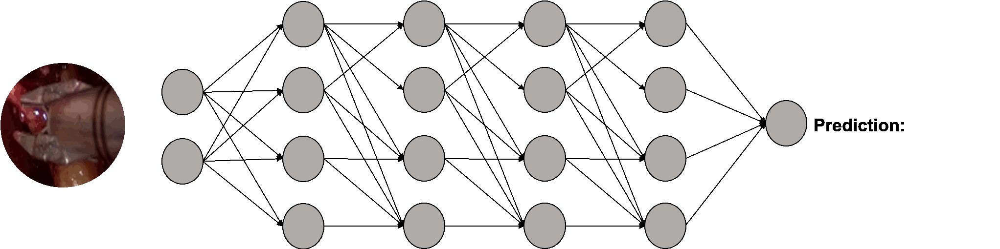

<div align="center">
<a href="http://camma.u-strasbg.fr/">

</a>
</div>

# AI4Surgery

**Neural Networks and Deep Learning**

_Deepak Alapatt and Pietro Mascagni, Vinkle Srivastav, Nicolas Padoy_

This short tutorial is designed to offer hands-on experience with artificial neural networks to surgeons with little to no coding experience.  

Following the structure of the associated "Neural Networks and Deep Learning" chapter from the "Artificial Intelligence in Surgery: An AI Primer for Surgical Practice" book, this notebook walks the users through a basic neural network implementation pipeline, from basic programming concepts in the python programming language to data handling and deep learning operations.      Finally, the user will be able to design, train and test a simple neural network for surgical tool classification.

<br/><br/>

<div align="center">

</div>

<br/><br/>


To begin, click the link below to launch your experiments in Google Colab, a cloud based platform giving you access to GPUs and TPUs to speed up your training.


### Hands-on using Pytorch

[](https://colab.research.google.com/github/CAMMA-public/ai4surgery/blob/master/ai4surgery_pt.ipynb)


### Hands-on using tensorflow

[](https://colab.research.google.com/github/CAMMA-public/ai4surgery/blob/master/ai4surgery_tf.ipynb)


## License
This source code, dataset, and annotations are licensed under the license found in the [`LICENSE`](LICENSE) file in the root directory of this source tree.
The Cholec-tinytools dataset used in this repository is publicly released under the Creative Commons licence [CC-BY-NC-SA 4.0](https://creativecommons.org/licenses/by-nc-sa/4.0/). This implies that:
- the dataset cannot be used for commercial purposes,
- the dataset can be transformed (additional annotations, etc.),
- the dataset can be redistributed as long as it is redistributed under the same license with the obligation to cite the contributing work which led to the generation of the Cholec-tinytools dataset (mentioned below).

By downloading and using this dataset, you agree to these terms and conditions.

## Citation
```bibtex
@book{alapatt2021aiinsurgery,
  author       = {Deepak Alapatt, Pietro Mascagni, Vinkle Srivastav, Nicolas Padoy}, 
  title        = {Artificial Intelligence in Surgery: Understanding the Role of AI in Surgical Practice (chapter: Neural Networks and Deep Learning)},
  publisher    = {McGraw-Hill Education / Medical},
  language     = {English},
  year         = 2021,
  volume       = 1,
  ISBN-10      = {1260452735},
  ISBN-13      = {978-1260452730}
}
```
[[`Download PDF`](https://arxiv.org/pdf/2009.13411.pdf)]

If you use the Cholec-tinytools dataset used in the demo notebook, you are kindly requested to cite the work that led to the generation of this dataset:
```bibtex
@article{twinanda2016endonet,
  title={Endonet: a deep architecture for recognition tasks on laparoscopic videos},
  author={Twinanda, Andru P and Shehata, Sherif and Mutter, Didier and Marescaux, Jacques and De Mathelin, Michel and Padoy, Nicolas},
  journal={IEEE transactions on medical imaging},
  volume={36},
  number={1},
  pages={86--97},
  year={2016},
  publisher={IEEE}
}
```
[[`Download PDF`](https://arxiv.org/pdf/1602.03012.pdf)]

```bibtex
@incollection{vardazaryan2018weakly,
  title={Weakly-supervised learning for tool localization in laparoscopic videos},
  author={Vardazaryan, Armine and Mutter, Didier and Marescaux, Jacques and Padoy, Nicolas},
  booktitle={MICCAI LABELS},
  pages={169--179},
  year={2018},
  publisher={Springer}
}
```

[[`Download PDF`](https://arxiv.org/pdf/1806.05573.pdf)]

